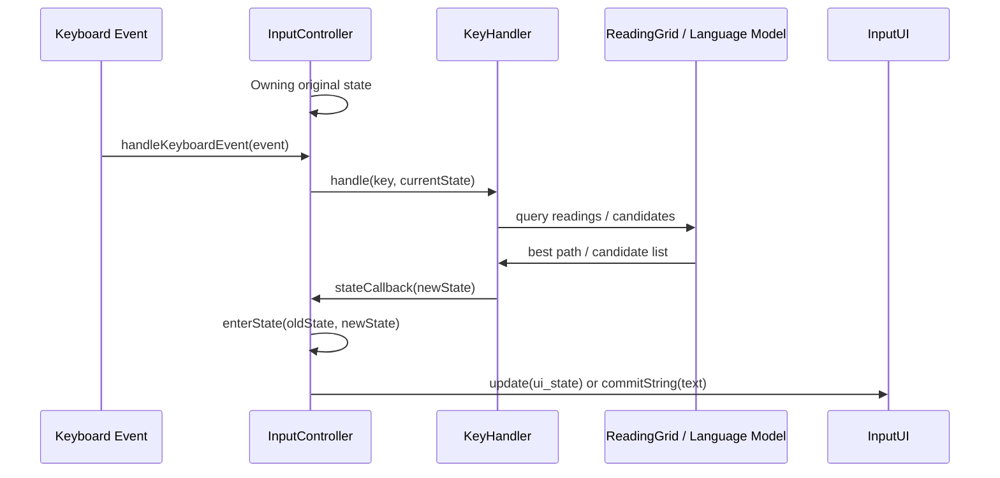

# McBopomofoWeb Components

This document describes the high-level architecture of the McBopomofoWeb
project. The repository contains more than the core input method engine: it
also includes phonetic parsing, reading-grid path search, text-conversion
services, and several platform adapters.

## Component Interaction Diagram

The following diagram illustrates the interaction between the main runtime
components of the input method engine.

## Core Engine

- **`InputController`**: The stateful orchestrator of the input method. It
  receives keyboard events, owns the current `InputState`, delegates key
  processing to `KeyHandler`, and forwards UI updates through `InputUI`.
- **`KeyHandler`**: The main decision engine for key events. It translates key
  presses into state transitions, commits, candidate selection, cursor motion,
  punctuation handling, and helper modes such as number input.
- **`InputState`**: A set of immutable state objects that describe the current
  editing phase, such as empty, inputting, choosing candidates, marking text,
  or number input.
- **`InputUI`**: An interface between the engine and a host UI. Different
  platforms implement this to display composing text, candidate windows,
  auxiliary notices, and committed text.
- **`Key`**: A platform-neutral representation of keyboard input used by the
  engine and tests.
- **`CandidateController`**: Handles candidate paging, key-to-candidate
  mapping, and cursor movement inside the candidate window.
- **`InputHelperNumber`**: Supports dedicated number-input workflows and keeps
  that logic separate from the main phonetic input path.
- **`CtrlEnterOption`**: Encodes Ctrl+Enter behavior choices used by the input
  engine and platform settings.

## Language Model And Path Search

- **`WebLanguageModel`**: Adapts the bundled phrase data into the
  `Gramambular2.LanguageModel` interface used by the engine.
- **`WebData` / `WebDataPlain`**: The bundled phrase database and its plain-text
  variant used for phrase lookup and build/runtime tradeoffs.
- **`ReadingGrid`**: A lattice of readings and candidate nodes. It is
  responsible for incremental updates around the cursor and for producing the
  best path through the current composition.
- **`LanguageModel`**: The abstract unigram language model interface used by
  `ReadingGrid`.
- **`UserOverrideModel`**: Tracks user preference signals so the engine can
  boost or suppress candidates during later selections.

## Phonetic Processing

- **`BopomofoSyllable`**: The core phonetic representation used throughout the
  system.
- **`BopomofoReadingBuffer`**: Builds a syllable incrementally from key presses
  before it becomes part of the reading grid.
- **`BopomofoKeyboardLayout`**: Maps physical keys to Bopomofo readings for
  multiple keyboard layouts.
- **`BopomofoCharacterMap`**: Provides character-level helpers used by the
  phonetic layer.

## Conversion And Utility Modules

- **`Service`**: A high-level API that exposes text conversion features outside
  the IME runtime, including text-to-Bopomofo, pinyin, ruby annotation, and
  braille-related conversions.
- **`DictionaryServices`**: Builds dictionary lookups and optional external
  reference links for characters and phrases.
- **`LocalizedStrings`**: Centralizes user-facing strings for different
  languages and features.
- **`InputMacro` / `InputMacroDate`**: Expands date/time and related macros into
  localized text during input.
- **`VariantAnnotator`**: Annotates committed text with Unicode IVS or PUA code
  points so supporting fonts can render Bopomofo alongside Han characters.
- **`WebBpmfvsVariants` / `WebBpmfvsPua`**: Data tables used by
  `VariantAnnotator`.

## Additional Conversion Libraries

- **`BopomofoBraille`**: Converts between Chinese text, Bopomofo, and Taiwanese
  braille. The `Converter` works together with token classes for syllables,
  digits, letters, and punctuation.
- **`ChineseNumbers`**: Converts numeric values into Chinese numeral forms,
  including regular and specialized output.
- **`SuzhouNumbers`**: Implements Suzhou numeral formatting.
- **`RomanNumbers`**: Converts numeric values into Roman numerals.
- **`LargeSync`**: A utility for storing larger payloads in Chrome extension
  storage by splitting and reconstructing data.

## Platform Adapters

- **`src/index.ts`**: Public package entry point that re-exports the main
  browser-facing APIs.
- **`src/chromeos_ime.ts`**: Chrome OS integration layer. It bridges the core
  engine to the Chrome IME APIs and Chrome extension UI/settings pages.
- **`src/pime.ts` / `src/pime_keys.ts`**: Windows PIME integration. These files
  adapt the engine to the PIME host process and key-event conventions.
- **`src/mcp.ts`**: Model Context Protocol server entry point exposing the text
  and braille conversion APIs over stdio for LLM tooling.

## Output Directories

- **`output/example/`**: Browser demo page and helper scripts for exercising the
  engine and conversion services manually.
- **`output/chromeos/`**: Chrome extension assets, options UI, help pages, and
  the built IME bundle.
- **`output/pime/`**: Windows PIME assets, settings/help pages, scripts, and
  the built adapter bundle.
- **`output/mcp/`**: Built MCP server bundle and launcher script.

## Testing

- Most implementation files have a colocated `*.test.ts` file.
- Unit tests cover core engine behavior, candidate logic, layout parsing,
  language-model interactions, conversion helpers, and platform-facing entry
  points.
