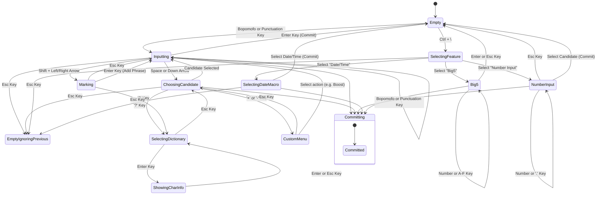

# McBopomofoWeb Input State Machine

This document provides an overview of the input state machine used in McBopomofoWeb. The state machine is responsible for managing the user's input, from handling key presses to displaying candidates and committing text.

## State Diagram

The following diagram illustrates the possible states and transitions in the input process.



## State Descriptions

-   **Empty**: The initial state. No input is being processed.
-   **Inputting**: The user is actively typing Bopomofo readings or punctuation. The composing buffer is displayed.
-   **ChoosingCandidate**: The user has pressed the spacebar or down arrow, and a list of candidates is displayed. The user can select a candidate using number keys, arrow keys, or the enter key.
-   **Marking**: The user is selecting a range of text in the composing buffer to add to the user dictionary.
-   **Committing**: The selected candidate or composed text is being committed to the application. This is a transient state that quickly transitions back to `Empty`.
-   **SelectingDictionary**: The user has pressed '?' on a candidate and is presented with dictionary lookup options.
-   **ShowingCharInfo**: Displays detailed information about the selected character.
-   **SelectingFeature**: The user has pressed `Ctrl + \` and is presented with a menu of special input features.
-   **Big5**: The user is inputting a Big5 code to enter a character.
-   **SelectingDateMacro**: The user is selecting a date or time macro to insert.
-   **NumberInput**: A unified state for handling various types of numerical input, including Chinese numbers, Roman numerals, and enclosing numbers.
-   **CustomMenu**: A menu is displayed for actions like boosting or excluding a phrase.
-   **EmptyIgnoringPrevious**: A transient state that transitions to `Empty` without committing any text. This is typically used when the user cancels an action.

```