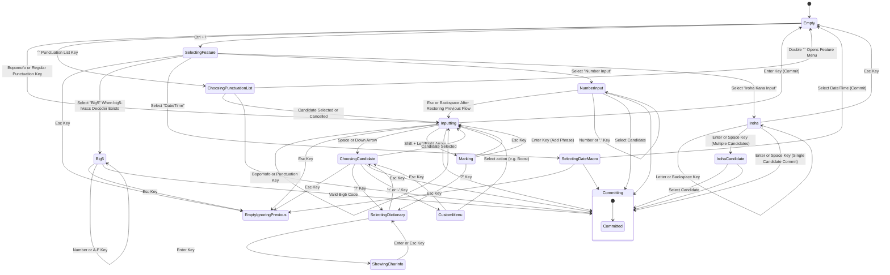

# McBopomofoWeb Input State Machine

This document provides an overview of the input state machine used in McBopomofoWeb. The state machine coordinates key handling, composing-buffer updates, candidate panels, custom input modes, and final text commits.

The implementation in `src/McBopomofo/InputState.ts` contains both user-visible states and a few helper/base states used to share behavior. This document focuses on the states that matter when reasoning about controller behavior.

## State Diagram

The following diagram illustrates the possible states and transitions in the input process.

```mermaid
stateDiagram
    [*] --> Empty

    Empty --> Inputting: Bopomofo or Regular Punctuation Key
    Empty --> ChoosingPunctuationList: '`' Punctuation List Key
    Empty --> SelectingFeature: Ctrl + \

    Inputting --> Inputting: Bopomofo or Punctuation Key
    Inputting --> Empty: Enter Key (Commit)
    Inputting --> EmptyIgnoringPrevious: Esc Key
    Inputting --> ChoosingCandidate: Space or Down Arrow
    Inputting --> Marking: Shift + Left/Right Arrow

    ChoosingCandidate --> Inputting: Candidate Selected
    ChoosingCandidate --> EmptyIgnoringPrevious: Esc Key
    ChoosingCandidate --> SelectingDictionary: '?' Key
    ChoosingCandidate --> CustomMenu: '+' or '-' Key

    ChoosingPunctuationList --> Empty: Double '`' Opens Feature Menu
    ChoosingPunctuationList --> Inputting: Candidate Selected or Cancelled

    Marking --> Inputting: Esc Key
    Marking --> Inputting: Enter Key (Add Phrase)
    Marking --> SelectingDictionary: '?' Key

    SelectingDictionary --> ChoosingCandidate: Esc Key
    SelectingDictionary --> ShowingCharInfo: Enter Key

    ShowingCharInfo --> SelectingDictionary: Enter or Esc Key

    SelectingFeature --> EmptyIgnoringPrevious: Esc Key
    SelectingFeature --> Big5: Select "Big5" When big5-hkscs Decoder Exists
    SelectingFeature --> SelectingDateMacro: Select "Date/Time"
    SelectingFeature --> NumberInput: Select "Number Input"
    SelectingFeature --> Iroha: Select "Iroha Kana Input"

    Big5 --> EmptyIgnoringPrevious: Esc Key
    Big5 --> Big5: Number or A-F Key
    Big5 --> Committing: Valid Big5 Code

    Iroha --> Empty: Esc Key
    Iroha --> Iroha: Letter or Backspace Key
    Iroha --> Committing: Enter or Space Key (Single Candidate Commit)
    Iroha --> IrohaCandidate: Enter or Space Key (Multiple Candidates)

    IrohaCandidate --> Committing: Select Candidate

    SelectingDateMacro --> EmptyIgnoringPrevious: Esc Key
    SelectingDateMacro --> Empty: Select Date/Time (Commit)

    NumberInput --> Inputting: Esc or Backspace After Restoring Previous Flow
    NumberInput --> NumberInput: Number or '.' Key
    NumberInput --> Committing: Select Candidate

    CustomMenu --> ChoosingCandidate: Esc Key
    CustomMenu --> Inputting: Select action (e.g. Boost)

    state Committing {
        [*] --> Committed
    }

    Inputting --> Committing
    ChoosingCandidate --> Committing
    ChoosingPunctuationList --> Committing
    NumberInput --> Committing
    SelectingDateMacro --> Committing
    IrohaCandidate --> Committing
```

## State Inventory

### Core states

- **Empty**: The initial state. No input is being processed.
- **EmptyIgnoringPrevious**: A transient cancellation state. Unlike `Empty`, it discards the previous state and must not commit any pending composing buffer.
- **Inputting**: The user is actively typing Bopomofo readings or regular punctuation. The composing buffer and cursor position are shown in the preedit area.
- **Committing**: A transient state that immediately commits a concrete string to the host application.

### Candidate-panel states

- **ChoosingCandidate**: The user has pressed the spacebar or down arrow, and a list of candidates is displayed. The user can select a candidate using number keys, arrow keys, or the enter key.
- **ChoosingPunctuationList**: A specialized candidate-selection state entered by pressing the backtick punctuation-list key. It reuses the candidate panel, but cursor movement inside the composition is disabled, and pressing backtick again opens the feature menu.
- **Marking**: The user is selecting a range of text in the composing buffer to add to the user dictionary.
- **SelectingDictionary**: The user has pressed '?' on a candidate and is presented with dictionary lookup options.
- **ShowingCharInfo**: Displays detailed information about the selected character.
- **CustomMenu**: A menu for actions on the current phrase, such as boosting or excluding a candidate.

These states all render through the same candidate-window path in `InputController`: `ChoosingCandidate`, `ChoosingPunctuationList`, `SelectingDictionary`, `ShowingCharInfo`, `SelectingFeature`, `SelectingDateMacro`, `NumberInput`, `IrohaCandidate`, and `CustomMenu`.

### Feature and custom-input states

- **SelectingFeature**: A feature picker entered with `Ctrl + \` or by pressing backtick twice from the punctuation-list panel. It exposes runtime-dependent features. `Big5` only appears when `TextDecoder("big5-hkscs")` is available; date/time macros, number input, and Iroha input are always present.
- **Big5**: The user is entering a Big5 code with an `[內碼]` composing-buffer prefix. A valid completed code commits a character directly; `Esc` cancels without commit.
- **SelectingDateMacro**: The user is selecting a date or time macro to insert.
- **NumberInput**: A unified numeric-input mode with a `[數字]` prefix. The candidate panel is populated from the current number string, and candidate shortcuts are displayed as shifted keys such as `⇧ 1`, `⇧ 2`, and so on.
- **Iroha**: The user is entering a romanized kana code for Iroha kana lookup. The composing buffer is shown with an `[伊呂波]` prefix.
- **IrohaCandidate**: The user has requested kana candidates for the current Iroha code and is selecting from the candidate list.

## Internal helper states

- **NotEmpty**: An internal base class for states that own a composing buffer, cursor index, and tooltip.
- **Feature**: A menu entry model used by `SelectingFeature` to produce the next state.
- **CustomMenuEntry**: A menu entry model used by `CustomMenu` to execute a callback.

## Notes on behavior

- Entering `Empty` from a `NotEmpty` state may commit the previous composing buffer. Entering `EmptyIgnoringPrevious` never does.
- `ChoosingPunctuationList` inherits from `ChoosingCandidate`, but the controller handles it specially so punctuation-list behavior wins over generic candidate-panel behavior.
- `SelectingDateMacro`, `NumberInput`, and `IrohaCandidate` commit the selected candidate directly instead of returning to `Inputting`.
- `Big5` and `Iroha` are custom-input modes with their own composing-buffer prefixes and do not use the normal Bopomofo preedit flow while active.
